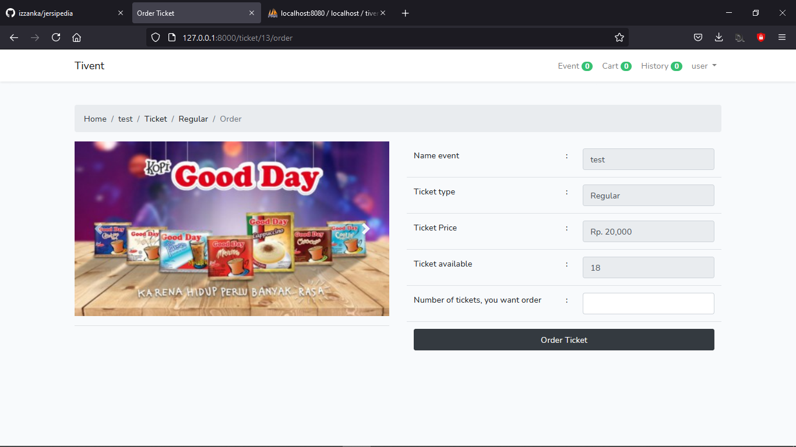

<!-- PROJECT LOGO -->
<p align="center">
  <h3 align="center">TIVENT</h3>
</p>

<!-- ABOUT THE PROJECT -->
## About The Project

TIVENT is a simple event ticket online shop

### Built With

* [Bootstrap](https://getbootstrap.com)
* [JQuery](https://jquery.com)
* [Laravel](https://laravel.com)

<!-- GETTING STARTED -->
## Getting Started

### Installation

* Clone the repo, then enter the project directory with terminal
```sh
composer install
```
```sh
cp .env.example .env
```
```sh
php artisan key:generate
```
* Create new database, then change the .env
```sh
php artisan migrate
```
* Run
```sh
php artisan serve
```

<!-- USAGE EXAMPLES -->
## Usage

* Link : https://tivent.000webhostapp.com





